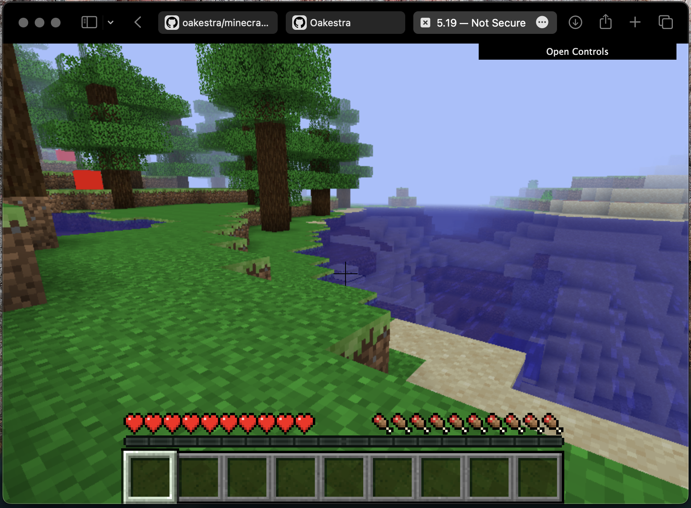
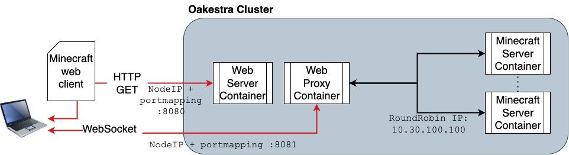
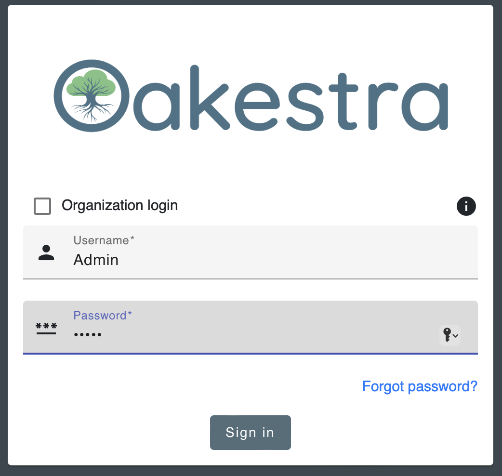
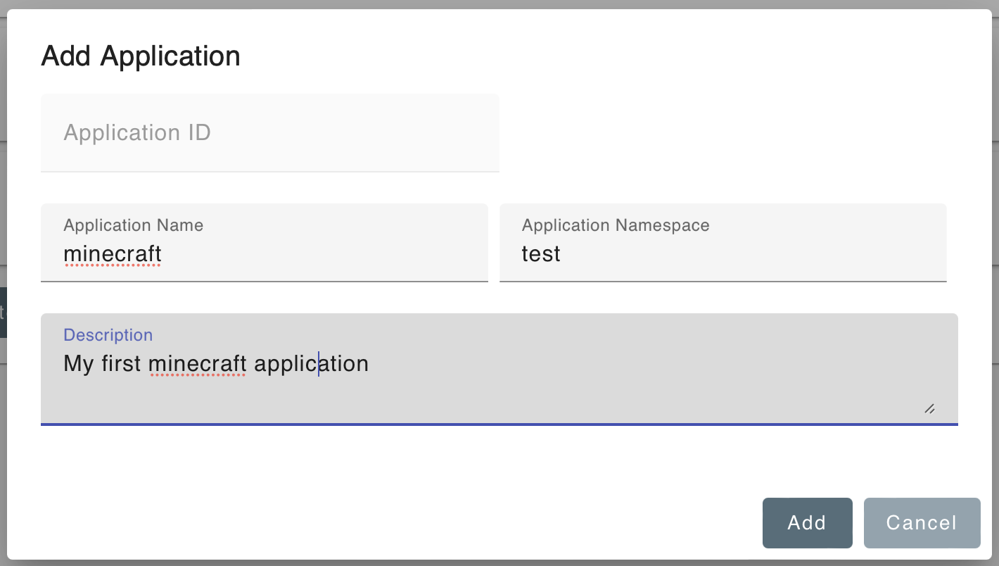
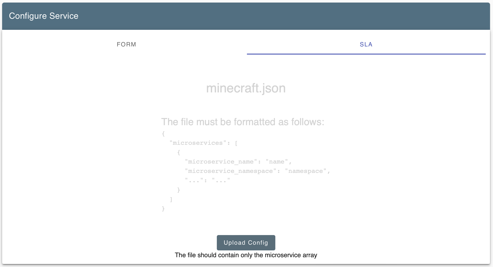
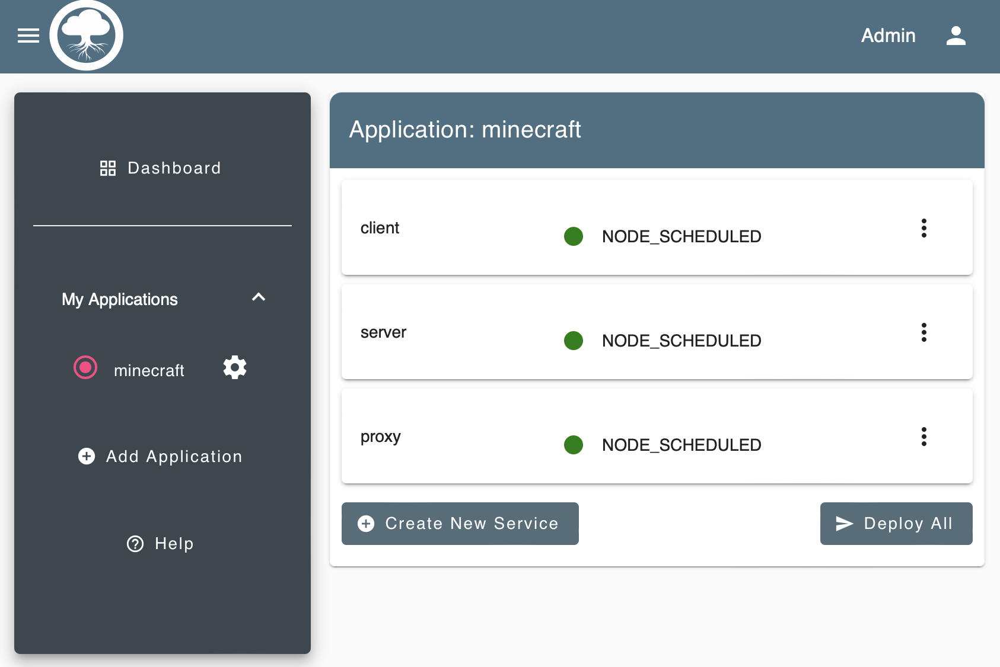
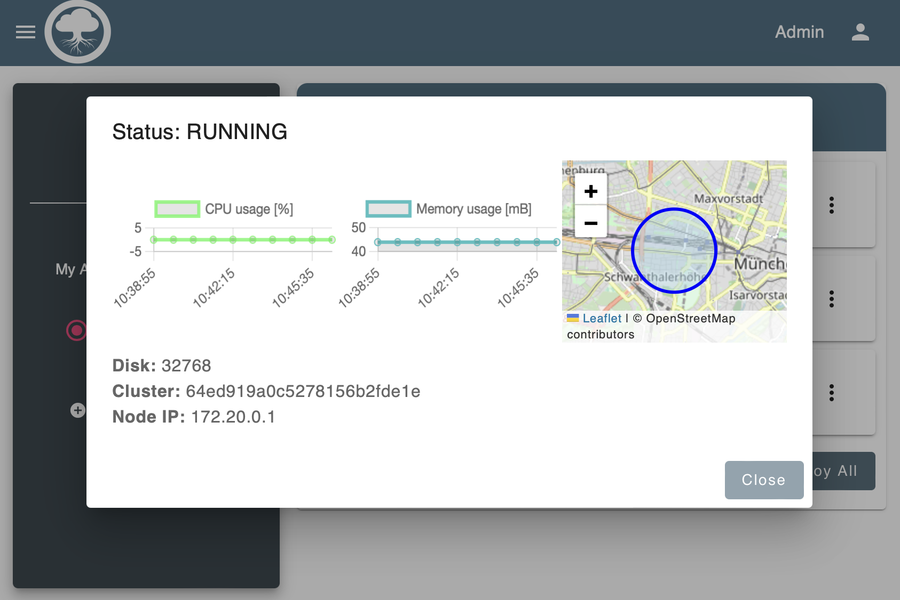

# Tutorial: Deploy Minecraft with Oakestra

With this tutorial we'll be able to:
- 🎮 Play Minecraft from a browser, no client installation needed (thanks to [WebMC](https://github.com/michaljaz/webmc))
- 👭 Play multiplayer locally or remotely 
- 🖥️ Host your Minecraft server ([Openhack](https://github.com/noelbundick/minecraft-server)) and proxy. 
- ⚙️ Scale your server instances to handle more users
- 🛠️ Customize your deployment 

## 🤔 What are we going to do

## ⚠️ Disclaimers ⛔️

This tutorial is not meant as a way to hack the game or play for without a license. This tutorial is a tech demo that uses already existing technologies and pieces of software to provide an example of how to use Oakestra with a toy use case. We do not take any responsibility for what the users will do with the proposed example. 

## Step 1 - 🌳 Create Your Oakestra Cluster

Get Oakestra up and running with at least one cluster and one worker node. 

Check out the official [Wiki](https://www.oakestra.io/docs/getstarted/get-started-cluster/)

## Step 2 - 🖼️ Access the Dashboard 

Open the Oakestra dashboard at 
http://< Root IP >

Login with your custom credentials or use the default: ID: `Admin`, Password: `Admin`

## Step 3 - 👾 Create the Minecraft app

## Step 4 - 📁 Upload the SLA

## Step 5 - 📲 Deploy All

## Step 6 - 🖥️ Monitor your deplyment

